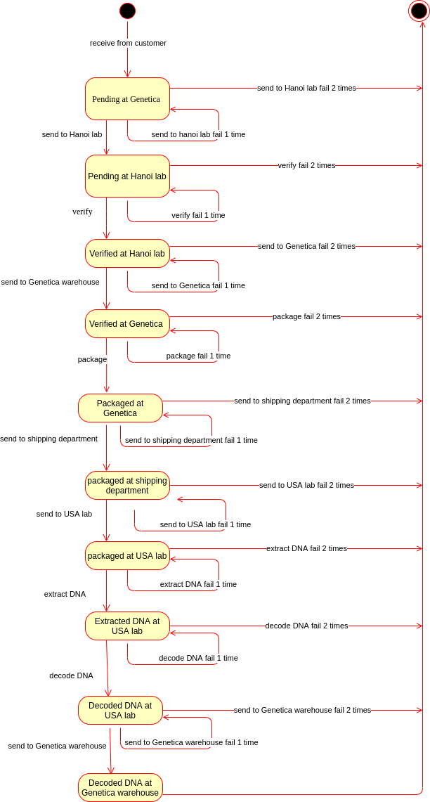
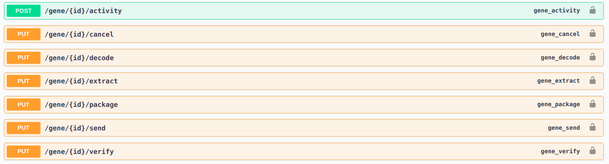
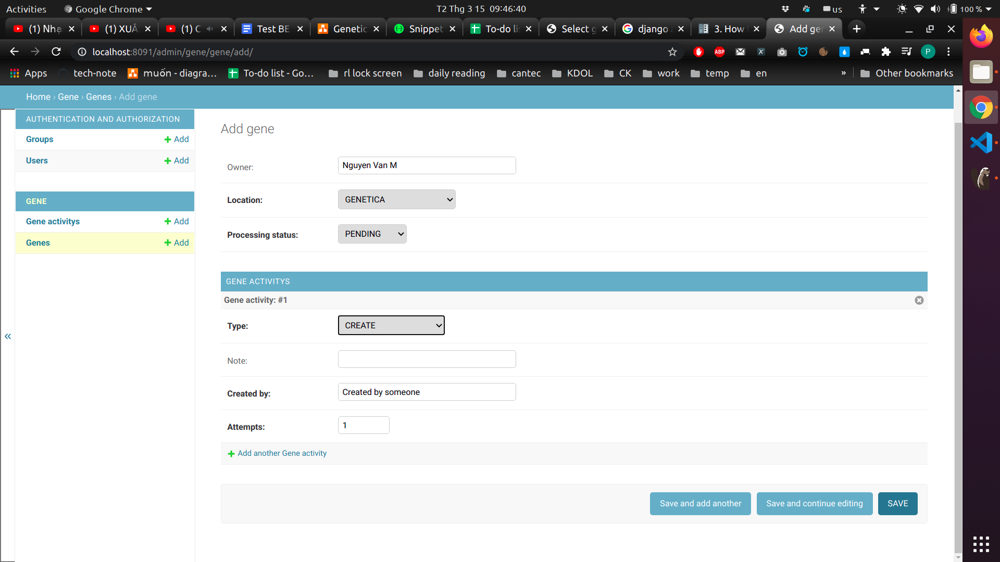
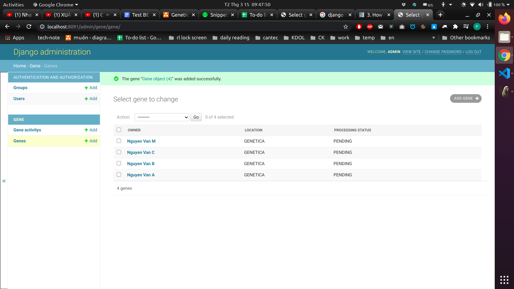
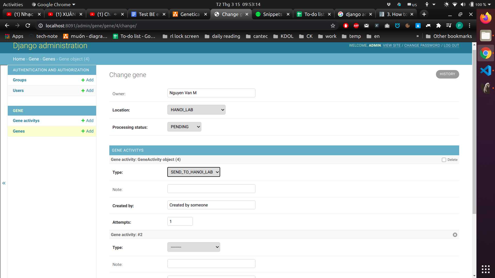
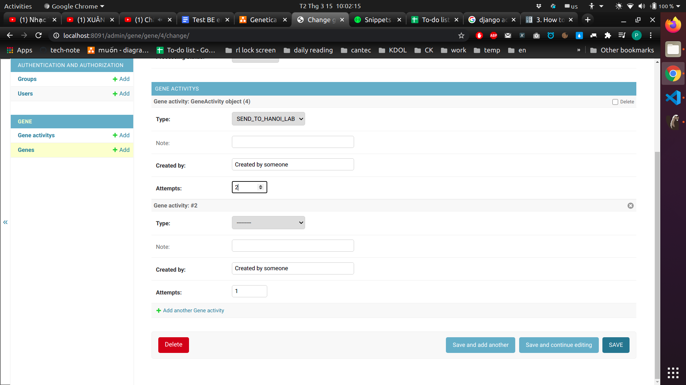
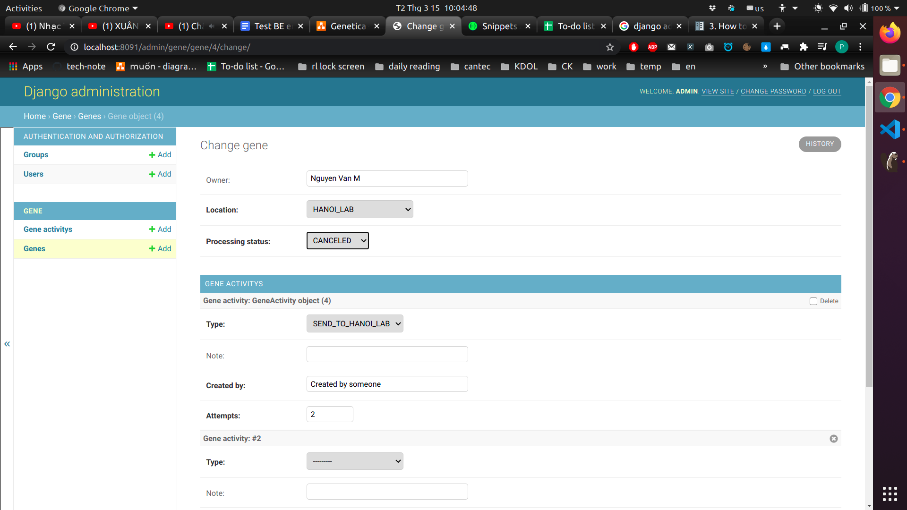

This is initial code for create sample codes in django rest framework
---


- [1. State diagram](#1-state-diagram)
- [2. Run project](#2-run-project)
  - [2.1. setup environment](#21-setup-environment)
  - [2.2. Run server and migrate database](#22-run-server-and-migrate-database)
  - [2.3. Access swagger](#23-access-swagger)
  - [2.4. Access admin site](#24-access-admin-site)
- [3. Ví dụ vận hành quy trình trên bằng admin django cho 2 trường hợp xử lý thành công và xử lý thất bại mẫu xét nghiệm gene](#3-ví-dụ-vận-hành-quy-trình-trên-bằng-admin-django-cho-2-trường-hợp-xử-lý-thành-công-và-xử-lý-thất-bại-mẫu-xét-nghiệm-gene)
  - [3.1. Mẫu xét nghiệm được xử lý thành công](#31-mẫu-xét-nghiệm-được-xử-lý-thành-công)
  - [3.2. Mẫu xét nghiệm xử lý thất bại](#32-mẫu-xét-nghiệm-xử-lý-thất-bại)


# 1. State diagram 

Đối tượng cần phân tích trạng thái là : 
    
    mẫu xét nghiệm gen của khách hàng

Các đối tượng người dùng sẽ tương tác với đối tượng cần phân tích trên là :

    Nhân viên kho hàng của Genetica
    Nhân viên Hanoi Lab
    Nhân viên USA Lab
    Nhân viên Shipping department 

Bên dưới là state diagram để vận hành quy trình theo dõi trạng thái của mẫu xét nghiệm gene trong Genetica.

**click vào ảnh để phóng to hoặc truy cập** [ tại đây ](https://viewer.diagrams.net/?highlight=0000ff&edit=_blank&layers=1&nav=1&title=Genetica#Uhttps%3A%2F%2Fdrive.google.com%2Fuc%3Fid%3D1jgJa0kHorvB35yWRY2YcznBngFpxx3p0%26export%3Ddownload)




**Giải thích biểu đồ trạng thái**

- **Trạng thái bắt đầu** - **Pending at Genetica**: là trạng thái hình thành khi khách hàng mới gửi mẫu xét nghiệm đến Genetica.
- **Pending at Hanoi lab**: là trạng thái hình thành khi Genetica gửi 1 mẫu mới đến Hanoi lab.
- **Verified at Hanoi lab**: là trạng thái hình thành khi Hanoi lab hoàn thành kiểm định mẫu xét nghiệm.
- **Verified at Genetica**: là trạng thái hình thành khi Hanoi lab gửi mẫu xét nghiệm đã kiểm định cho Genetica.
- **Packaged at Genetica**: là trạng thái hình thành khi Genetica đã hoàn thành đóng gói mẫu xét nghiệm đã được kiểm định.
- **Package at Shipping department**: là trạng thái hình thành khi genetica đã gửi mẫu xét nghiệm đã được đóng gói cho bộ phận vận chuyển.
- **Packaged at USA lab** : là trạng thái hình thành khi bộ phận USA lab đã nhận được gói xét nghiệm từ bộ phận vận chuyển.
- **Extracted at USA lab** : là trạng thái hình thành khi USA lab hoàn thành chiết tách mẫu xét nghiệm.
- **Decoded at USA lab** : là trạng thái hình thành khi USA lab hoàn thành giải mã gen cho mẫu xét nghiệm.
- **Decoded at Genetica** : là trạng thái hình thành khi Genetica nhận được mẫu xét nghiệm đã được giải mã từ USA lab.
- **Trạng thái kết thúc**, có 2 khả năng dẫn đến kết thúc quá trình xử lý của 1 mẫu xét nghiệm:
  - **Decoded at genetica**: mẫu xét nghiệm đã được giải mã và đang lưu trữ tại genetica
  - **Cancel** : mẫu xét nghiệm bị hủy vì bị lỗi quá 2 lần trong bất cứ thao tác xử lý nào với nó.


Dựa vào biểu đồ trạng thái hoạt động trên ta thấy rằng 1 trạng thái hoạt động của 1 mẫu gen phụ thuộc vào
2 thuộc tính: trạng thái đã được xử lý của mẫu xét nghiệm đó (*proccessing_status*), và vị trí nó đang được lưu trữ (*location*). Vì vậy ta thiết kế database model cho Gene có 2 thuộc tính trên như sau:

```python
class Gene(models.Model):
    owner = models.CharField(max_length=100, null=True, blank=True)
    processing_status = models.IntegerField(choices=GeneStatus.choices())
    location = models.IntegerField(choices=GeneLocation.choices())
    created_at = models.DateTimeField(
        verbose_name=_("created at"),
        default=timezone.now,
        editable=False,
        help_text=_("Created at."),
    )
```

với các giá trị mà 2 thuộc tính *processing_status* và *location* có thể nhận được là :

```python

class GeneStatus(BaseEnum):
    PENDING = 1
    VERIFIED = 2
    EXTRACTED = 3
    PACKAGED = 4
    DECODED = 5
    CANCELED = 6


class GeneLocation(BaseEnum):
    GENETICA = 1
    HANOI_LAB = 2
    SHIPPING_DEPARTMENT = 3
    USA_LAB = 4
```

và các hành động mà người dùng sẽ tương tác với mẫu xét nghiệm là: 

```python

class GeneActivityType(BaseEnum):
    CREATE = 0
    VERIFY = 1
    EXTRACT = 2
    PACKAGE = 3
    DECODE = 4
    SEND_TO_GENETICA = 5
    SEND_TO_HANOI_LAB = 6
    SEND_TO_USA_LAB = 7
    SEND_TO_SHIPPING = 8
    CANCEL = 9
```

Ta sẽ cần thêm 1 database model để lưu trữ trạng thái của các hành động này : 

```python

class GeneActivity(models.Model):
    gene_sample = models.ForeignKey(Gene, on_delete=models.CASCADE)
    created_at = models.DateTimeField(
        verbose_name=_("created at"),
        default=timezone.now,
        editable=False,
        help_text=_("Created at."),
    )
    type = models.IntegerField(choices=GeneActivityType.choices())
    note = models.CharField(max_length=100, null=True, blank=True)
    created_by = models.CharField(default="Created by someone", max_length=100)
    attempts = models.IntegerField(default=1)
```

Ta có thể chỉ cần dùng api `PUT /gene/{id}` thay đổi trạng thái của 1 mẫu gene để vận hành quy trình trên, nhưng để clear nghiệp vụ trong source code ta nên tạo các api tương ứng với các hành động trên :




# 2. Run project

Có thể truy cập link sau để  truy cập vào deployment của project trên **AWS EC2**:

trang admin: http://52.220.204.132:8091/admin với tài khoản `admin/admin`

trang swagger: http://52.220.204.132:8091/swagger

Hoặc setup trên local theo hướng dẫn bên dưới

## 2.1. setup environment

```shell
python version: 3.8.0
ubuntu: 20.04
docker: Docker version 20.10.3, build 48d30b5
docker-compose version 1.26.0, build d4451659
```

```shell
pip install -r requirements.txt
```

## 2.2. Run server and migrate database

```shell
docker-compose up -d
make docker-makemigrations
make docker-migrate
make docker-create-supperuser
make docker-create-sample-data
```
## 2.3. Access swagger

http://127.0.0.1:8091/swagger/

## 2.4. Access admin site

http://127.0.0.1:8091/admin

Account as above: admin/admin


# 3. Ví dụ vận hành quy trình trên bằng admin django cho 2 trường hợp xử lý thành công và xử lý thất bại mẫu xét nghiệm gene 

**CHÚ Ý :** logic giới hạn việc chuyển từ trạng thái này sang trạng thái khác chỉ được thực hiện trong các api, chưa được thực hiện trong django admin, vì vậy ta sẽ có thể  lựa chọn tùy ý giá trị cho 2 thuộc tính `location` và `processing_status` trên django admin. Hiện tại, Django admin chỉ để mô phỏng việc vận hành quy trình trên từ phía các nhân viên Genetica.

## 3.1. Mẫu xét nghiệm được xử lý thành công

Người dùng gửi mẫu cho Genetica, nhân viên (NV) genetica nhập thông tin mẫu vào hệ thống với các thông tin như sau :





NV genetica gửi mẫu cho Hanoi Lab, nhân viên Hanoi lab nhận được mẫu và cập nhật thông tin vị trí mẫu như sau : 



Cứ như vậy, khi mẫu xét nghiệm đang lưu trú tại bộ phận nào thì nhân viên bộ phận đó sẽ phải cập nhật thông tin trạng thái của mẫu xét nghiệm lên hệ thống.

## 3.2. Mẫu xét nghiệm xử lý thất bại

NV genetica gửi mẫu cho Hanoi lab thất bại lần 1, gửi lại mẫu xét nghiệm cho Hanoi lab lần 2 và cập nhật activity attemps cho mẫu xét nghiệm như sau : 



NV genetica gửi mẫu xét nghiệm cho Hanoi lab thất bại lần thứ 2, NV genetica sẽ hủy mẫu xét nghiệm và cập nhật processing_status cho mẫu xét nghiệm như sau :

